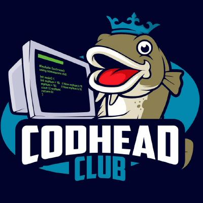

# Awesome Resources  

## Contents

1. [Introduction](README.md#introduction)
   - [Contributing](README.md##contributing)
2. [Communities](Communities.md)
3. [Business/Career](Communities.md#business)
4. [Services](README.md#services)
5. [Software](README.md#software)
6. [Programming](Programming.md)
7. [Ethics, Law & Professionalism](Ethics_Law_Professionalism.md)
   - [Ethics](Ethics_Law_Professionalism.md#ethics)
   - [Professionalism & Standards](Ethics_Law_Professionalism.md#standards)
   - [Law](Ethics_Law_Professionalism.md#law)
8. [Learning Resources](README.md#education)
9. [Linux Distributions](README.md#linux)
10. [Sysadmin](Sysadmin.md)
11. [Electronics](Electronics.md)
12. [Hypervisors and virtual machines](Virtualisation.md#virtualisation)
    - [Andrew Hancock, VMware vExpert PRO](Virtualisation.md#andrewhancock)
13. [Cyber Security Resources](CyberSecurity.md)
14. [Other Interesting Stuff](README.md#misc)

## Guides/Cheatsheets

1. [Well known port numbers](https://networkencyclopedia.com/well-known-port-numbers/)
2. [How to use SSH](https://www.ssh.com/ssh/command/)

## NGINX

1. [How to Redirect URL in NGINX](https://ubiq.co/tech-blog/redirect-url-nginx/)

## Powershell

1. [Introduction to Powershell](https://learn.microsoft.com/en-us/powershell/scripting/learn/ps101/00-introduction?view=powershell-7.2)
2. [Powershell Learning Resources](https://jdhitsolutions.com/blog/essential-powershell-resources/)
3. [Have PowerShell trigger an action when CPU or memory usage reaches certain values](https://www.powershelladmin.com/wiki/Have_PowerShell_trigger_an_action_when_CPU_or_memory_usage_reaches_certain_values.php)
4. [PowerShell Changing the WMI Timeout Value for a Series of WMI Queries](https://www.powershelladmin.com/wiki/Powershell_change_the_wmi_timeout_value.php)
5. [Powershell benchmarking module built around measure command](https://www.powershelladmin.com/wiki/PowerShell_benchmarking_module_built_around_Measure-Command.php)
6. [Example PowerShell function for validating an IPv6 address](https://www.powershelladmin.com/wiki/PowerShell_.NET_regex_to_validate_IPv6_address_(RFC-compliant).php)
7. [Open-source PowerShell RSI Calculator (Relative Strength Index)](https://www.powershelladmin.com/wiki/PowerShell%20Relative%20Strength%20Index%20(RSI)%20Calculator.php)
8. [How To Check If A File Exists With PowerShell](https://www.powershelladmin.com/wiki/PowerShell_check_if_file_exists.php)
9. [How to Check If A Folder Exists With PowerShell](https://www.powershelladmin.com/wiki/Powershell_check_if_folder_exists.php)
10. [PowerShell Cmdlet for Splitting an Array](https://www.powershelladmin.com/wiki/PowerShell_Cmdlet_for_Splitting_an_Array.php)
11. [PowerShell Executables File Systeem Locations](https://www.powershelladmin.com/wiki/PowerShell_Executables_File_System_Locations.php)
12. [PowerShell ForEach Loops/Objects](https://www.powershelladmin.com/wiki/PowerShell_foreach_loops_and_ForEach-Object.php)
13. [PowerShell Get-MountPointData Cmdlet](https://www.powershelladmin.com/wiki/PowerShell_Get-MountPointData_Cmdlet.php)
14. [PowersShell Java Autoupdate](https://www.powershelladmin.com/wiki/PowerShell_Java_Auto-Update_Script.php)
15 [PowerShell Multi-line Comments](https://www.powershelladmin.com/wiki/Powershell_multi-line_comments.php)
16. [PowerShell Prompt for Password Convert Securestring to plain text](https://www.powershelladmin.com/wiki/Powershell_prompt_for_password_convert_securestring_to_plain_text.php)
17. [A Simple Example Of Running A PowerShell Command With PsExec](https://www.powershelladmin.com/wiki/Powershell_psexec_wrapper.php)
18. [Powershell regex to accurately match IPV4 address](https://www.powershelladmin.com/wiki/PowerShell_regex_to_accurately_match_IPv4_address_(0-255_only).php)
19. [Regular Expressions in PowerShell](https://www.powershelladmin.com/wiki/Powershell_regular_expressions.php)
20. [Splitting on Whitespace Using the PowerShell -split Operator](https://www.powershelladmin.com/wiki/Powershell_split_operator.php)
21. [Powershell vs Perl at text processing](https://www.powershelladmin.com/wiki/Powershell_vs_perl_at_text_processing.php)
22. [Powershell Scripts (Paloalto Networks)](https://unit42.paloaltonetworks.com/tag/powershell-scripts/)
23. [Powershell by Example](https://powershellbyexample.dev/)
24. [Learn Powershell- PowerShell.org](https://powershell.org/2022/07/learn-powershell-in-5-painless-steps-storage-variables-arrays-hashtables-step-1/)
## Tools

1. [Cloudron](https://www.cloudron.io/index.html)
